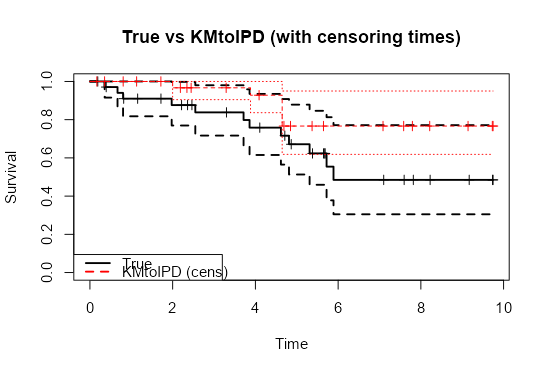
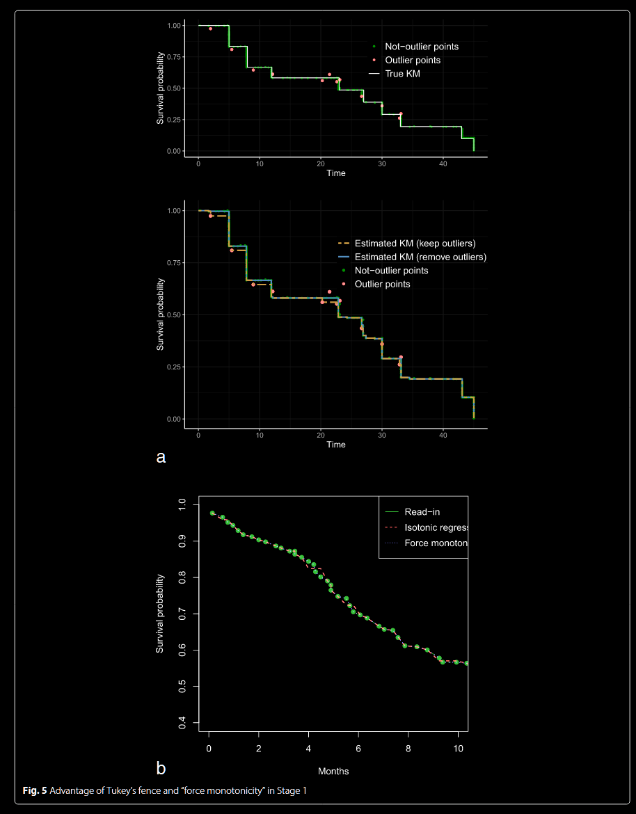
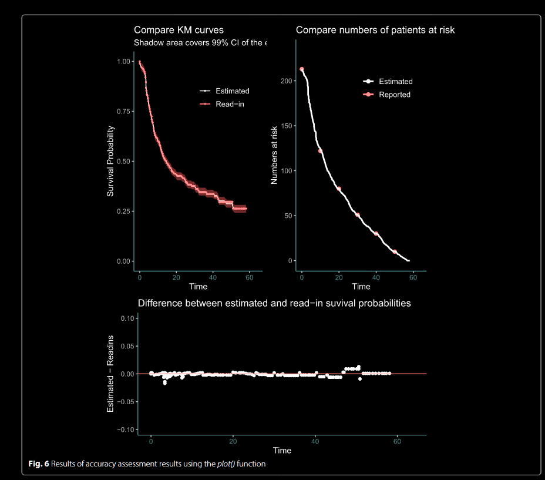
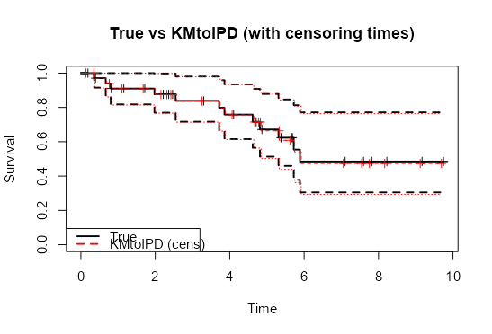
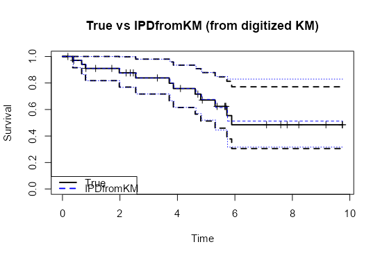
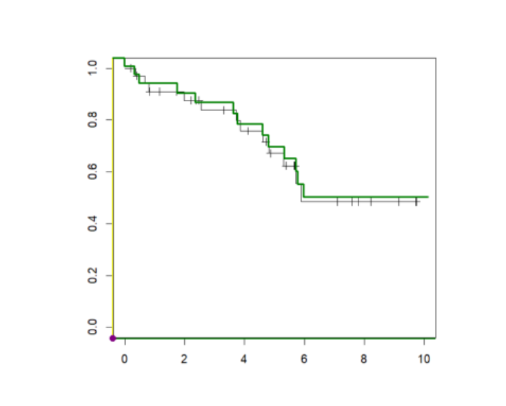
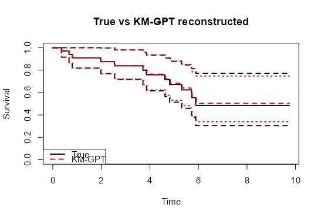

# Outline
- digitize method
- Test
- Prospect

# Digitize method

::: {.justify}
## Method
- SurvdigitizeR
- Manual
- Info-extract tool
:::

::: {.justify}
## Concerns

Manual: Hard to deal with large number of samples, no matter accuracy and speed

SurvdigitizedR: Strictly restricted to plus sign extracting, CI is not allowed, plus sign must in a different color with the KM curve

- No censoring: RMSE 0.009 < 0.01
- With censoring: RMSE 0.016 > 0.013

Info-extract tool: Like ScanIt and DigitizeIt, can't get censoring data

- Have to manually do both steps

::: 

## EX1

## EX2

## EX3

::: {.justify}
## Popular plan
- Our plan: Use SurvdigitizedR for the KM curve and manually select the censoring point
- JHU plan: CEN-KM, almost same, but use AI for selecting censoring point, better for large samples
:::

# Test

## KMtoIPD

> rmse_kmto_cens
[1] 0.0106005

## IPDfromKM

> rmse_kmfrom_cens
[1] 0.01921025

## KM-GPT

##

+ rmse_kmgpt
[1] 0.01365449

# Further Discussion

## Image processing

allow CI, legend......

## closure comparison

compare functions

number of risk: small to large, sample sequence and benchmarking methods(No paper did this)

## get censoring points

training NN, especially for plus sign(situations like different colors, same color, overlapping......)

CEN-KM cannot cover all the idea